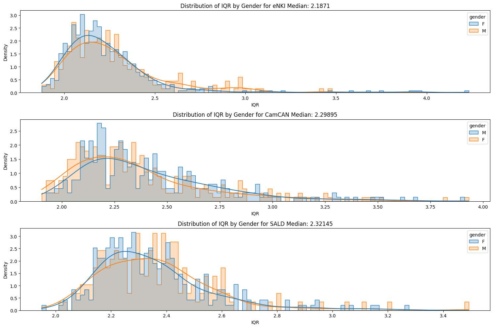
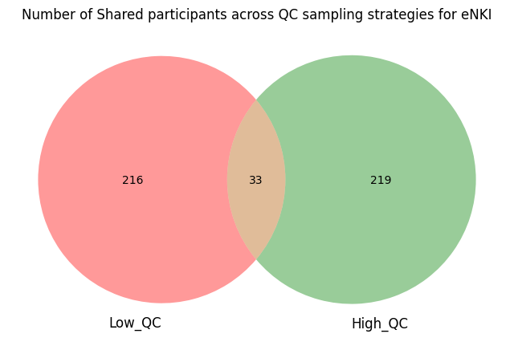
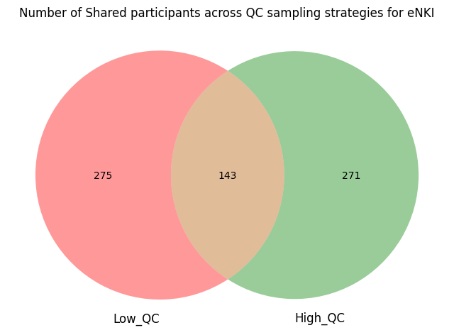
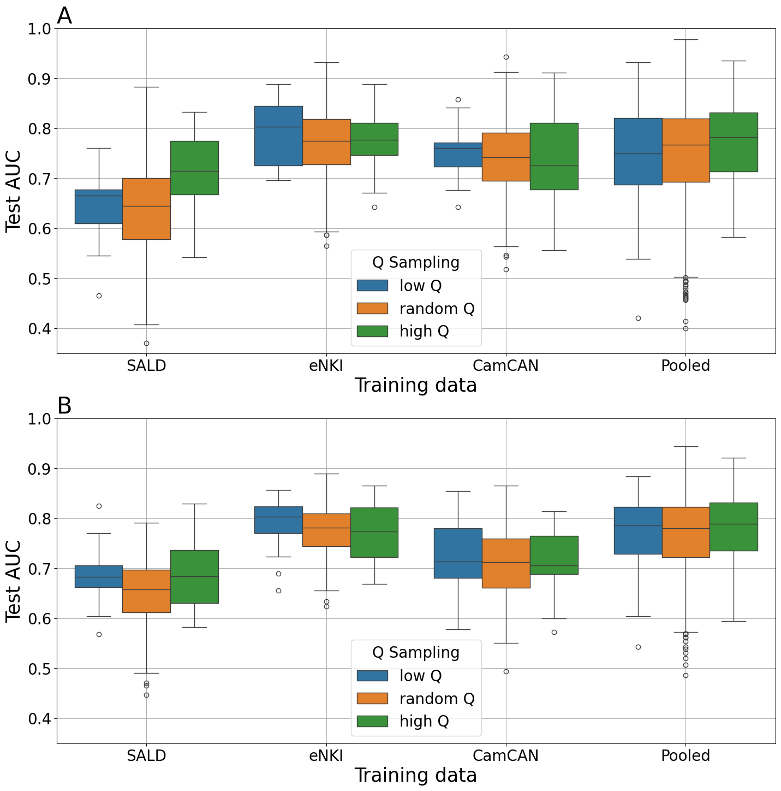

# The Impact of MRI Image Quality on Statistical and Predictive Analysis on Voxel-Based Morphology

## About

The Forschungszentrum Jülich Machine Learning Library

It is currently being developed and maintained at the [Applied Machine Learning](https://www.fz-juelich.de/en/inm/inm-7/research-groups/applied-machine-learning-aml) group at [Forschungszentrum Juelich](https://www.fz-juelich.de/en), Germany.


## Overview

This repository contains the scripts, data processing pipelines, and analysis code required to reproduce the results presented in the paper *"The impact of MRI image quality on statistical and predictive analysis on voxel-based morphology."* The study investigates how MRI image quality affects univariate statistical analyses and machine learning-based predictions in voxel-based morphology (VBM). By leveraging three large, publicly available datasets, the paper highlights the importance of image quality and sample size in neuroimaging research.

**Paper Abstract:**

MRI brain scans are affected by image artifacts caused by head motion, influencing derived measures such as brain volume and cortical thickness. This study examines the role of automated image quality assessment (IQA) in controlling for the effects of poor-quality images on statistical and predictive analyses. Key findings include:

- Image quality significantly impacts the detection of sex/gender differences in univariate group comparisons, especially for smaller samples.
- Increasing sample size and image quality improves statistical power in univariate analyses but has a marginal effect on classification accuracy for machine learning approaches.
- For univariate methods, higher image quality is crucial, while machine learning benefits more from larger sample sizes.

**Paper Link:** https://arxiv.org/abs/2411.01268

# Replicate obtained results.
1. **Clone the repository:**

   ```bash
   git clone https://github.com/N-Nieto/QC.git
   cd QC

## Repository Structure

- `data/`: Data can be publically downloaded and should be stored as X_(site).csv Y_(site).csv QC_(site).csv.
- `code/statistics/`: Python scripts for univariate statistical tests, machine learning experiments, and IQA evaluations.
- `code/sex_classification/`: Python scripts for machine learning sex classification.
- `output/statistics`: Directory to store analysis outputs. Contains the experiment results used in the plots.
- `output/ML`: Directory to store analysis outputs. Contains the experiment results used in the plots.
- `plot/`: Jupyter notebooks providing step-by-step workflows for reproducing key results and figures from the paper.

# Create the enviroment to reproduce the code 

2. **Create conda environment**
```
conda env create -f environment_QC.yml
```
3. **Activate conda environment**
```
conda activate QC_env
```

# Data Exploration

## To get familiar with the data, let's first plot the QC distribution of the data

<p align="center">

</p>

# Lib exploration

## The sampling by QC

The core of this work is to sample the site data using the QC information.
For generating low, high or random QC, the function
```balance_data_age_gender_Qsampling``` from ```lib/data_processing.py```.
This function uses age bins to balance the data.

## The logic of this functions is as follows

1. For a given age bin, compute how many images for each gender exist.
2. Repeat this for all age bins and find the minimun value.
3. Now we know what is the number of images to sample for each gender in each age bin
4. For each age bin, sort the images acording QC (invers, direct or randomly)
5. Retain the minimun value

For example, lets assume we have 3 age bins. In the first bin, there are 20 images of male and 15 of female. In the second 40 and 10 for male and female and in the last 50 and 100. 
In this case, the minimun possible to sample is 10, as is the minimun of female in bin 2.

Now, we will sample **10** males and females in the first, second and last bin. For the first age bin, we will select 10 of the 20 males. How? accordingly with the QC of the images.

For the females, we will get 10 of the 15 possible. As you are suspecting, if we sample with low QC or high QC, there will be 5 images that there will be in both samples. This is why, the sampling participants can be shared for different QC sampling strategies.

As you already guess, for the females in the second bin, does not matter how we will sample, we will always get the same 10 images.

### If you select a lower number of age bins, there will be more images selected, but the samples will be more overlaped. If you select a high number of age bins, less images will be selected but the cohort will be more different between each other.


# For example, for eNKI
## For 10 age bins
<p align="center">

</p>

## For 3 age bins

<p align="center">

</p>

# hint: you can generate this plots with

```
python code/plots/count_shared_participants.py
```

# Statistical analysis

### The statistical analysis is performed in the following fashion.

1. Load the data
2. Sample the data according different QC
3. For each feature, separate the data for each sex/gender
4. Perform a t-test between the feature distribution
5. Save the p-value
6. If the p-value is small, the features distributions are distint.

For high and low high QC, you should run
```
python code/statistics/statistics_univariate.py
```

For random QC, the script is repeated N=20 times. You can set this values on the script and then run
```
python code/statistics/statistics_univariate_randomQ_repeated.py
```


# Sex classification using Machine Learning

## There are two main ways to run the classification

### For single site, the data is loaded, sampled, and splited in train/test folds using a 5 Repetitions 5 Folds cross validation

For high and low high QC, you should run
```
python code/sex_classicitation/sex_classification_single_site.py
```

For random QC, the script is repeated N=20 times. You can set this values on the script and then run
```
python code/statistics/sex_classification_single_site_randomQ_repeated.py
```


### For pooled data, the data is loaded, sampled, and splited in train/test folds using a 5 Repetitions 5 Folds cross validation

For high and low high QC, you should run
```
python code/sex_classicitation/sex_classification_pooled_data.py
```

For random QC, the script is repeated N=20 times. You can set this values on the script and then run
```
python code/statistics/sex_classification_pooled_data_randomQ_repeated.py
```

# Main result. 
## A: Results for site and pooled data using 10 age bins.
## B: Results for site and pooled data using 3 age bins.
<p align="center">

</p>